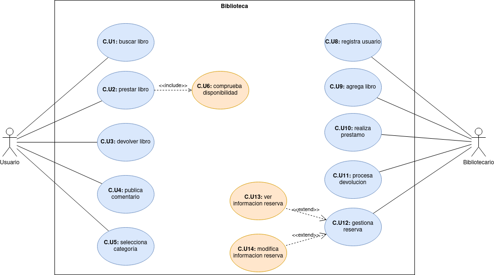

# Proyecto 
## Ruben Abreu Gonzalez
---
1. [Casos de uso](#diagrama-casos-de-uso)
2. [Diagrama de clases](#diagrama-de-clases)
3. [Diagrama](#diagrama)

### Recurso

Ejercicio

https://github.com/jpexposito/docencia/tree/master/Primero/ETS/PROYECTO

---

## Diagrama casos de uso

### Actor
#### Usuario
|  Actor | Usuario |
|---|---|
| Descripción  | _actor que interactua con la biblioteca_  |
| Características  |  |
| Relaciones | |
| Referencias | _buscar libro, prestar libro, devolver libro, dejar comentario, ver libros de cada categoria_ |   
|  Notas | |
| Autor  | _rubenag_ |
|Fecha | _20/12/2023_ |

#### Bibliotecario
|  Actor | Bibliotecario |
|---|---|
| Descripción  | _actor que gestiona el sistema de la biblioteca_  |
| Características  |  |
| Relaciones | |
| Referencias | _registrar usuario, agregar libro, realizar prestamo, procesar devolucion, gestionar reservas, visualizar informacion, modificar informacion_ |   
|  Notas | |
| Autor  | _rubenag_ |
|Fecha | _20/12/2023_ |
---
### Atributos
#### Usuario
|  Atributo |||
|---|---|---|
| _Nombre_  | _Descripción_  | _Tipo_ |
| _nombre_ | | _String_ | 
| _numero de identificacion_ | | _int_ |
| _historial de prestamos_ | | _List\<Prestamo>_ |
| | |

#### Bibliotecario
|  Atributo |||
|---|---|---|
| _Nombre_  | _Descripción_  | _Tipo_ |
| _nombre_ | | _String_ | 
| _numero de empleado_ | | _int_ |
| _horario laboral_ | | _String_ |
| | |
---
### Casos de uso
#### Usuario
|  Caso de Uso	CU | Buscar libro  |
|---|---|
| Fuentes  | [recurso](#recurso)  |
| Actor  |  _Usuario_ |
| Descripción | _El usuario busca un libro por título, autor o categoria_  |
| Flujo básico | |
| Pre-condiciones | |  
| Post-condiciones  | |  
|  Requerimientos | |
|  Notas |  |
| Autor  | _rubenag_ |
|Fecha | _20/12/2023_ |

|  Caso de Uso	CU | Prestar libro  |
|---|---|
| Fuentes  | [recurso](#recurso)  |
| Actor  |  _Usuario_ |
| Descripción | _El usuario presta un libro_  |
| Flujo básico | |
| Pre-condiciones | comprobar dispobibilidad |  
| Post-condiciones  | |  
|  Requerimientos | |
|  Notas |  |
| Autor  | _rubenag_ |
|Fecha | _20/12/2023_ |

|  Caso de Uso	CU | Devolver libro  |
|---|---|
| Fuentes  | [recurso](#recurso)  |
| Actor  |  _Usuario_ |
| Descripción | _El usuario devuelve un libro prestado_  |
| Flujo básico | |
| Pre-condiciones | |  
| Post-condiciones  | |  
|  Requerimientos | |
|  Notas |  |
| Autor  | _rubenag_ |
|Fecha | _20/12/2023_ |

|  Caso de Uso	CU | Publicar comentario  |
|---|---|
| Fuentes  | [recurso](#recurso)  |
| Actor  |  _Usuario_ |
| Descripción | _El usuario deja un comentario en un libro_  |
| Flujo básico | |
| Pre-condiciones | |  
| Post-condiciones  | |  
|  Requerimientos | |
|  Notas |  |
| Autor  | _rubenag_ |
|Fecha | _20/12/2023_ |

|  Caso de Uso	CU | Seleccionar categoria  |
|---|---|
| Fuentes  | [recurso](#recurso)  |
| Actor  |  _Usuario_ |
| Descripción | _El usuario selecciona una categoría y ve la lista de libros en esa categoría_  |
| Flujo básico | |
| Pre-condiciones | |  
| Post-condiciones  | |  
|  Requerimientos | |
|  Notas |  |
| Autor  | _rubenag_ |
|Fecha | _20/12/2023_ |

|  Caso de Uso	CU | Comprobar disponibilidad |
|---|---|
| Fuentes  | [recurso](#recurso)  |
| Actor  |  _Usuario_ |
| Descripción | _El usuario comprueba que el libro a prestar esta disponible_  |
| Flujo básico | |
| Pre-condiciones | |  
| Post-condiciones  | |  
|  Requerimientos | |
|  Notas |  |
| Autor  | _rubenag_ |
|Fecha | _20/12/2023_ |

#### Bibliotecario
|  Caso de Uso	CU | registrar usuario |
|---|---|
| Fuentes  | [recurso](#recurso)  |
| Actor  |  _Bibliotecario_ |
| Descripción | _El bibliotecario registra a un nuevo usuario en el sistema_  |
| Flujo básico | |
| Pre-condiciones | |  
| Post-condiciones  | |  
|  Requerimientos | |
|  Notas |  |
| Autor  | _rubenag_ |
|Fecha | _20/12/2023_ |

|  Caso de Uso	CU | agregar libro |
|---|---|
| Fuentes  | [recurso](#recurso)  |
| Actor  |  _Bibliotecario_ |
| Descripción | _El bibliotecario agrega un nuevo libro al sistema_  |
| Flujo básico | |
| Pre-condiciones | |  
| Post-condiciones  | |  
|  Requerimientos | |
|  Notas |  |
| Autor  | _rubenag_ |
|Fecha | _20/12/2023_ |

|  Caso de Uso	CU | realizar prestamo |
|---|---|
| Fuentes  | [recurso](#recurso)  |
| Actor  |  _Bibliotecario_ |
| Descripción | _El bibliotecario realiza un préstamo a un usuario_  |
| Flujo básico | |
| Pre-condiciones | |  
| Post-condiciones  | |  
|  Requerimientos | |
|  Notas |  |
| Autor  | _rubenag_ |
|Fecha | _20/12/2023_ |

|  Caso de Uso	CU | procesa devolucion |
|---|---|
| Fuentes  | [recurso](#recurso)  |
| Actor  |  _Bibliotecario_ |
| Descripción | _El bibliotecario procesa la devolución de un libro_  |
| Flujo básico | |
| Pre-condiciones | |  
| Post-condiciones  | |  
|  Requerimientos | |
|  Notas |  |
| Autor  | _rubenag_ |
|Fecha | _20/12/2023_ |

|  Caso de Uso	CU | gestiona reserva |
|---|---|
| Fuentes  | [recurso](#recurso)  |
| Actor  |  _Bibliotecario_ |
| Descripción | _El bibliotecario gestiona las reservas de libros_  |
| Flujo básico | |
| Pre-condiciones | |  
| Post-condiciones  | |  
|  Requerimientos | |
|  Notas |  |
| Autor  | _rubenag_ |
|Fecha | _20/12/2023_ |

|  Caso de Uso	CU | ver informacion reserva |
|---|---|
| Fuentes  | [recurso](#recurso)  |
| Actor  |  _Bibliotecario_ |
| Descripción | _El bibliotecario visualiza información de las reservas de libros_  |
| Flujo básico | |
| Pre-condiciones | |  
| Post-condiciones  | |  
|  Requerimientos | |
|  Notas |  |
| Autor  | _rubenag_ |
|Fecha | _20/12/2023_ |

|  Caso de Uso	CU | modificar informacion reserva |
|---|---|
| Fuentes  | [recurso](#recurso)  |
| Actor  |  _Bibliotecario_ |
| Descripción | _El bibliotecario modifica información de las reservas de libros_  |
| Flujo básico | |
| Pre-condiciones | |  
| Post-condiciones  | |  
|  Requerimientos | |
|  Notas |  |
| Autor  | _rubenag_ |
|Fecha | _20/12/2023_ |

## Diagrama de clases
> [!NOTE]
> Hola

## Diagrama
